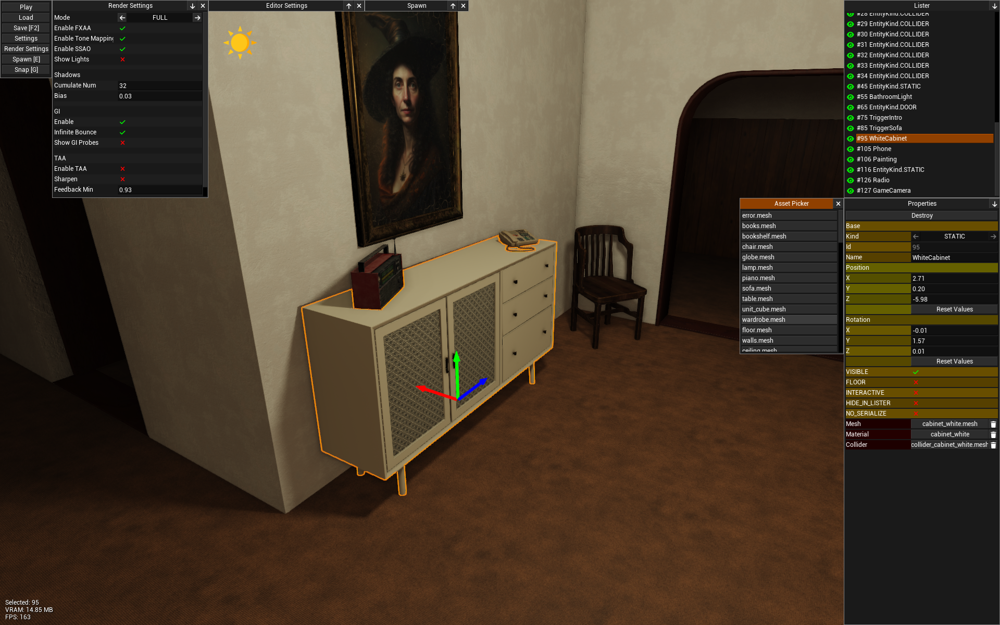
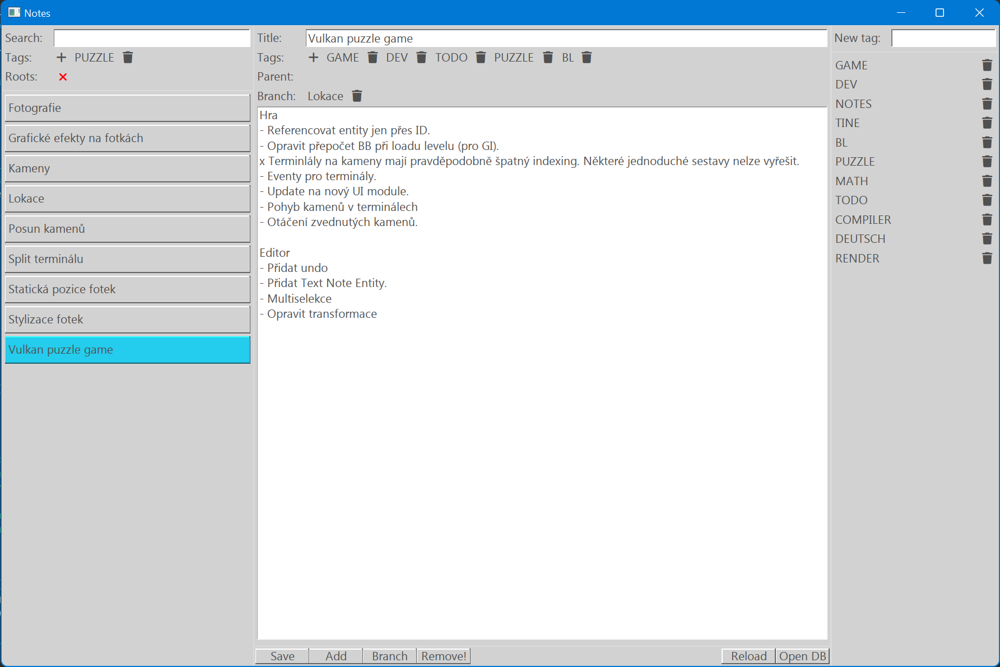

# Biscuit Programming Language

The Biscuit Language (BL) is a simple imperative programming language using LLVM backend and compiler implemented in C.
**Language syntax and all its features are still in development.** Biscuit is designed to be simple, fast, and explicit.

- Project homepage: [biscuitlang.org](https://biscuitlang.org)
- Discord: [here](https://discord.gg/DDTCcYzb9h)
- Contact email: [biscuitlang@gmail.com](mailto:biscuitlang@gmail.com)
- Twitch: [here](https://www.twitch.tv/travis_md)

Language design and a lot of core principles are based on the hard work of [Jonathan Blow](https://en.wikipedia.org/wiki/Jonathan_Blow), who, over the past few years, has been working on the JAI programming language. You can watch his streams on [Twitch](https://www.twitch.tv/j_blow). I liked the idea of C++ replacement a lot from the beginning, and since Blow's project is not publicly available, I've started implementing my language from scratch. The syntax is very similar to JAI, but it's not the same language (you cannot just compile JAI code using this compiler). In general, BL tends to be a C sequel rather than C++ replacement, the goal is to cover use cases where you're forced to pick C++ just because C lacks a particular feature, but otherwise would be fine.

# Features
* Strongly typed.
* Embedded rich runtime type information.
* Polymorphic functions and structures (generics).
* Simple structure inheritance.
* Compile-time execution (experimental).
* Compile-time function arguments; allow passing types as values (experimental).
* C ABI compatible (C library functions can be directly called).
* Runtime debugging is possible in Visual Studio/gdb/lldb.
* Explicit function overloading.
* Integrated build system.
* Module management.
* Unit testing system.
* Automatic documentation generation.
* Defer statement.
* Multiple return values.
* Custom memory allocators.
* Basic support for game development via `extra` packages.
* Supports Windows, Linux and macOS.
* Nested functions.
* And more...

# Installation
See the installation guide [here](https://biscuitlang.org).

# Example
```rust
#import "std/print"

HelloWorld :: struct {
    hello: s32;
    world: s32;
};

main :: fn () s32 {
    info :: cast(*TypeInfoStruct) typeinfo(HelloWorld);

    loop i := 0; i < info.members.len; i += 1 {
        print("% ", info.members[i].name);
    }
    print("!!!\n");

    return 0;
}
```

See more examples [here](https://biscuitlang.org).

# Build From Source

## Windows

* Install Visual Studio 2022 or [MS Build Tools](https://visualstudio.microsoft.com/visual-cpp-build-tools) with C/C++ support.
* Run `vcvars64.bat` in your shell or use Visual Studio Developer Command Prompt.
* Download and compile.

```bash
git clone https://github.com/biscuitlang/bl.git
cd bl
build.bat
```

## Linux

* Install LLVM. This step might differ across linux distributions, following snippet might help.

```bash
# Ubuntu
apt-get install llvm-18-dev

# Fedora
dnf copr enable -y @fedora-llvm-team/llvm-snapshots
dnf install llvm18-devel

# Using LLVM installation script
wget https://apt.llvm.org/llvm.sh
chmod +x llvm.sh
sudo ./llvm.sh 18
```

* Download and compile.

```bash
git clone https://github.com/biscuitlang/bl.git
cd bl
./build.sh
```

## macOS
* Install command line tools `xcode-select --install`.
* Install dependencies using [brew](https://brew.sh) `brew install llvm@18 zlib ncurses`.
* Download and compile

```bash
git clone https://github.com/biscuitlang/bl.git
cd bl
./build.sh
```

# Authors

- **Martin Dorazil** (travis) [SPONSOR](https://www.paypal.com/donate/?hosted_button_id=WKSP23ADBFDP6)
- **Gmos**

# FAQ

* Why does this even exist?

I enjoy programming in simple languages like C, but sometimes I need a bit more abstract things. Having a custom language brings a pretty nice possibility to add all you need or miss from your conventional language like C.
And, it's fun to work on.

* Does language support XYZ?

Probably not, I'm the only one working on the compiler and I usually do only things I need. Feel free to contribute.

* Is it production ready?

Depends on what you mean by production, but I would prefer this language to be used on smaller pet projects first before diving into corporate bullshit.

* Can this language be used as C++ replacement?

In some cases yes, but you might run into trouble since there is no strong community behind the language and the new religion was not established yet.

# Projects Using BL

### Tine Text Editor

Text editor I use.

- Download [here](https://travisdp.itch.io/tine).
- Source code [here](https://github.com/travisdoor/tine).

<div style="text-align:center"></div>

### Vulkan Renderer & The Game

Screenshot of an unnamed 3D experimental game created using BL.

<div style="text-align:center"></div>

[Video](https://youtu.be/8nconux9oxM)

### Notes App

<div style="text-align:center"></div>

### Space Shooter

- Source code [here](https://github.com/biscuitlang/bl/tree/master/how-to/gunner).

<div style="text-align:center"></div>

# Contribution

Please follow the instructions on [wiki](https://github.com/biscuitlang/bl/wiki/Contribution).

# Links

- [Tree Sitter](https://github.com/GmosNM/tree-sitter-bl) parser done by Gmos.
